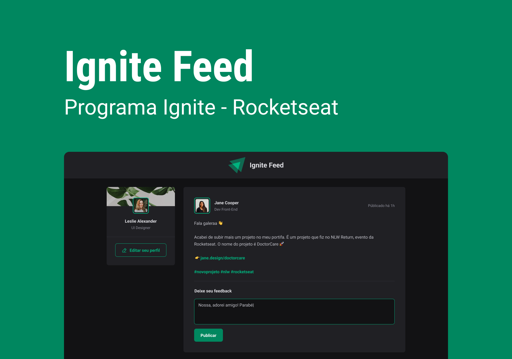

# React + TypeScript + Vite
<h1 align="center">Ignite timer </h1>

Programa exclusivo e promovido pela Rocketseat para ensino de tecnologias WEB.  

  <a href="#-tecnologias">Tecnologias</a>&nbsp;&nbsp;&nbsp;|&nbsp;&nbsp;&nbsp;
  <a href="#-projeto">Projeto</a>&nbsp;&nbsp;&nbsp;|&nbsp;&nbsp;&nbsp;
  <a href="#-layout">Layout</a>&nbsp;&nbsp;&nbsp;|&nbsp;&nbsp;&nbsp;
  <a href="#memo-licença">Licença</a>

  

 

  

## 🚀 Conteúdo:

- Estrutura da Aplicação
- Páginas e rotas
- Formulários
- Funcionalidades da aplicação
- contexto no React
- Reducers

## 💻 Projeto

Construir uma aplicação completa com roteamento e diversos conceitos importantes de ecossistema React como ContextAPI, useReducer, immer e muito mais.

- [Acesse o projeto finalizado, online](https://github.com/AnaVelho/Ignite)

## 🔖 Layout

Você pode visualizar o layout do projeto através [Desse Link]
(https://www.figma.com/design/TzO7VFnHYnjEARwUzRkMzt/Ignite-Feed-(Community)?node-id=0-1&p=f&t=LmwawyiHV3dm7WJD-0) É necessário ter conta no [Figma](https://figma.com) para acessá-lo.

Feito by Rocketseat :wave: [Participe da nossa comunidade!]
(https://discord.gg/rocketseat)